# User Manual
## Personalized Certification & Mock Board Reviewer

Version 1.0 · Applies to all users (Student, Instructor, Administrator)

---

## Table of Contents

1. [System Overview](#1-system-overview)
2. [Getting Started](#2-getting-started)
3. [Logging In](#3-logging-in)
4. [First-Time Setup (Student)](#4-first-time-setup-student)
5. [Approval Pending Screen](#5-approval-pending-screen)
6. [Student Guide](#6-student-guide)
7. [Instructor Guide](#7-instructor-guide)
8. [Administrator Guide](#8-administrator-guide)
9. [Sidebar & Common Actions](#9-sidebar--common-actions)
10. [Badges & Readiness Meaning](#10-badges--readiness-meaning)
11. [Troubleshooting](#11-troubleshooting)
12. [Frequently Asked Questions](#12-frequently-asked-questions)
13. [Appendix A: Screenshot Checklist](#appendix-a-screenshot-checklist)

---

## 1. System Overview

The **Personalized Certification & Mock Board Reviewer** is a web-based review system that lets learners take mock board exams, receive personalized study recommendations, and track their readiness for licensure or certification exams (e.g., LET, CPA, Internal Certification).

It is used by three types of users:

| Role | What they do |
|---|---|
| **Student** | Takes mock exams, reviews missed questions, views analytics and certification status |
| **Instructor** | Sets up exams, manages the question bank, and monitors class and student performance |
| **Administrator** | Manages users, global exam settings, branding, audit logs, and certification management |

> The system is accessed through a web browser. No installation is required.

---

## 2. Getting Started

### 2.1 Requirements
- A modern web browser: **Google Chrome**, **Microsoft Edge**, or **Firefox** (latest version recommended)
- An internet connection
- A device with a screen large enough to display the dashboard comfortably (laptop, desktop, or tablet)

### 2.2 Accessing the System
1. Open your web browser.
2. Go to the web address (URL) provided by your school or administrator, for example: `https://your-reviewer-app.up.railway.app`.
3. You will see the **Login** page with the school logo and the title "Personalized Certification & Mock Board Reviewer".

> If the page does not load, check your internet connection or contact your administrator.

### 2.3 Creating an Account
- **Students and Instructors:** Accounts are created by the administrator. If you do not have an account yet, contact your admin. There is **no self-registration** for students or instructors.
- **Administrator (first time only):** The very first admin account is created through a special "Admin Registration" page. See [Section 8.1](#81-first-time-setup--creating-the-first-admin-account).

---

## 3. Logging In

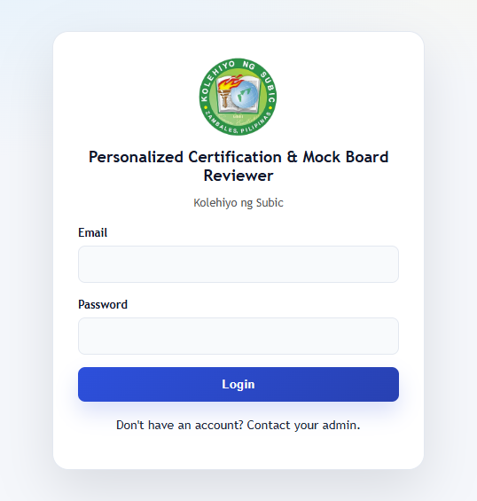

1. On the **Login** page, enter your **Email**.
2. Enter your **Password**.
3. Click the **Login** button.
   - The button will show "Logging in..." while it processes.
4. You are taken to the **Dashboard**.
   - If your password was assigned as a temporary one and the system asks you to change it, you will be taken to the **Change Password** page first.

**Important notes:**
- Sessions expire after **2 hours** of inactivity. You will be logged out automatically and must log in again.
- Failed logins show an error message. Check that your email and password are correct.

---

## 4. First-Time Setup (Student)

When a student logs in for the first time, the **"Student Profile & Exam Setup"** form appears on the Dashboard. You must complete it before you can take exams.

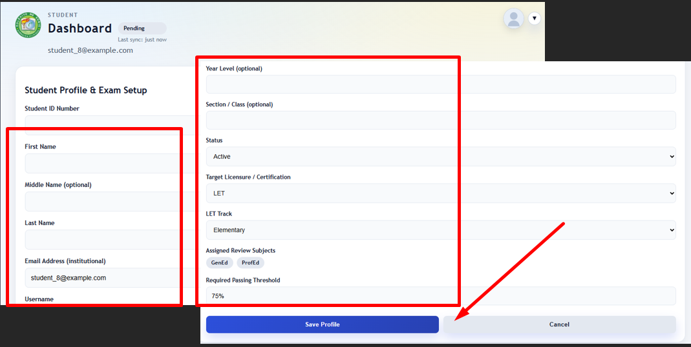

### 4.1 Fields to fill in

| Field | Required? | Notes |
|---|---|---|
| Student ID Number | Yes | Your official student ID |
| First Name | Yes | |
| Middle Name | No | |
| Last Name | Yes | |
| Email Address (institutional) | Yes | Pre-filled from your account; cannot be edited |
| Username | Yes | |
| Program / Degree | Yes | e.g., BSED, BSA |
| Year Level | No | A number from 1 to 6 |
| Section / Class | No | |
| Status | Yes | Active / Inactive / Graduated |
| Target Licensure / Certification | Yes | Choose from the categories the admin defined (e.g., LET, CPA) |
| LET Track | Only if target is LET | Elementary or Secondary |
| Major / Specialization | Only if LET + Secondary | e.g., Mathematics, Filipino, Social Studies, English |

### 4.2 Read-only fields (auto-computed)
- **Assigned Review Subjects** — shown as chips; these are automatically set based on your target licensure and track.
- **Required Passing Threshold** — the pass mark for your category, shown as a percentage (e.g., 75%).

### 4.3 Saving your profile
1. Click **Save Profile**.
2. The system saves your profile and automatically submits an **access request** to the administrator.
3. Depending on your status:
   - If approval is still pending, you are taken to the **Approval Pending** screen (see [Section 5](#5-approval-pending-screen)).
   - If you are already approved, a confirmation appears and you can click **Take exam** to go to the exam.

> You can edit your profile later from the Dashboard. When you save changes, a new access request is sent to the admin for review.

---

## 5. Approval Pending Screen

While your account is waiting for approval, you will see the **"Approval Pending"** screen.

- It shows your email and a **Pending** status badge.
- It **automatically checks every 10 seconds** and redirects you to the Dashboard as soon as the administrator approves your account. You do not need to refresh.
- Depending on your status you may see:
  - **Awaiting admin approval** — normal pending state; please wait.
  - **Access denied** — your request was denied or your account is inactive. Click **Resend approval request** or contact the admin.
  - **Approval request expired** — the request expired after **7 days**. Click **Resend approval request** to notify the admin again.

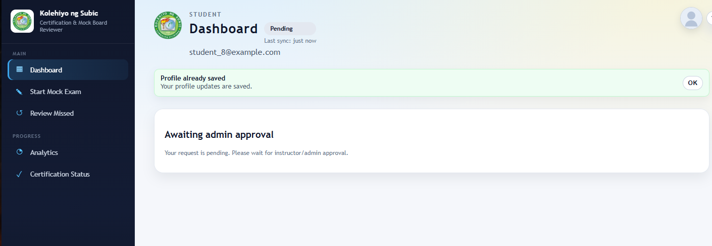

---

## 6. Student Guide

### 6.1 Student Dashboard
After approval, the Dashboard shows:

- **Summary cards** at the top:
  - **Exams Taken**
  - **Average Score**
  - **Pass Rate**
  - **Current Badge**
- **Best / Weakest Subject** highlights
- **Readiness Forecast** — shows your predicted readiness and lists **weak subjects** (subjects you should review first).
- **Personalized Recommendations** — the system suggests:
  - **Suggested Activity** (what to do next)
  - **Recommended Difficulty** (e.g., Board, Intermediate, Guided, Foundational)
  - **Review Materials** — grouped by subject, with suggested items to study
  - **Weekly Review Schedule** — a 7-day plan; click to expand
- **Profile** section — a collapsible panel where you can review and edit your profile.

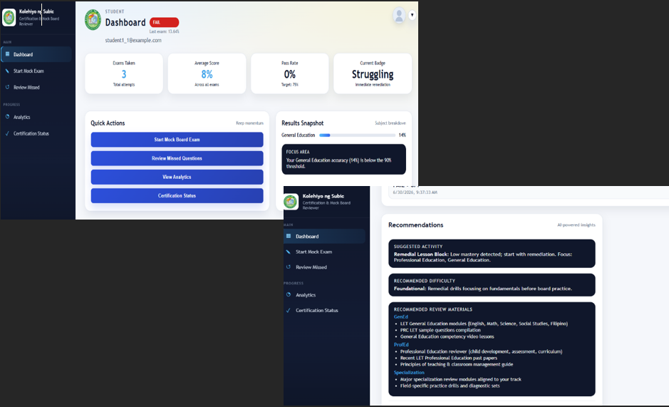

### 6.2 Taking a Mock Exam

1. From the sidebar, click **Start Mock Exam** (or **Take Exam** from the Dashboard).
2. The **Exam Preview** screen shows the exam rules (number of items, time limit, passing threshold).
3. Click **Start Exam** to begin.

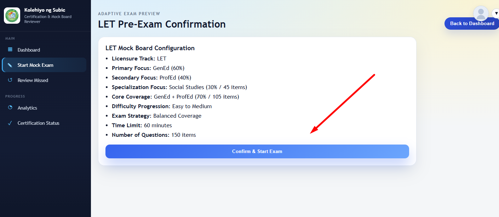
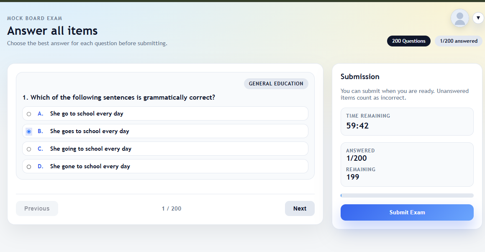

**While taking the exam:**
- A **timer** counts down. The exam **auto-submits** when time runs out.
- Answer each question; you can move between questions.
- Submit when you are finished.
- Your score is computed and compared against the passing threshold for your target licensure.

### 6.3 Review Missed Questions

1. From the sidebar, click **Review Missed**.
2. Review each question you answered incorrectly, along with the correct answer and explanation.
3. Use this to focus your study before the next attempt.

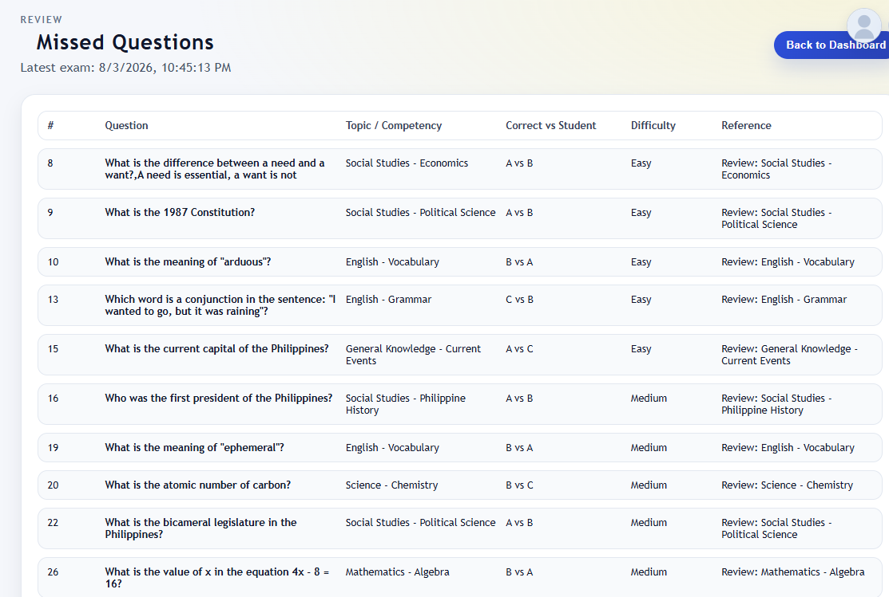

### 6.4 Analytics

1. From the sidebar, open **Analytics**.
2. View your **score history** across all exams taken.
3. See **trends** and your performance per subject so you know where you are improving.

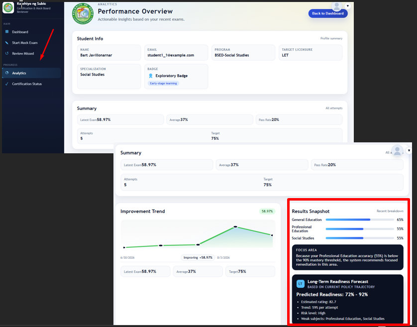

### 6.5 Certification Status

1. From the sidebar, open **Certification Status**.
2. Check whether you are **eligible** for certification.
3. **Eligibility rule:** you must achieve **3 consecutive passing mock board attempts** based on your category threshold. Once eligible, the admin can issue your certificate.
4. If a certificate has been issued, your **verification code** is shown here so you can prove its authenticity.

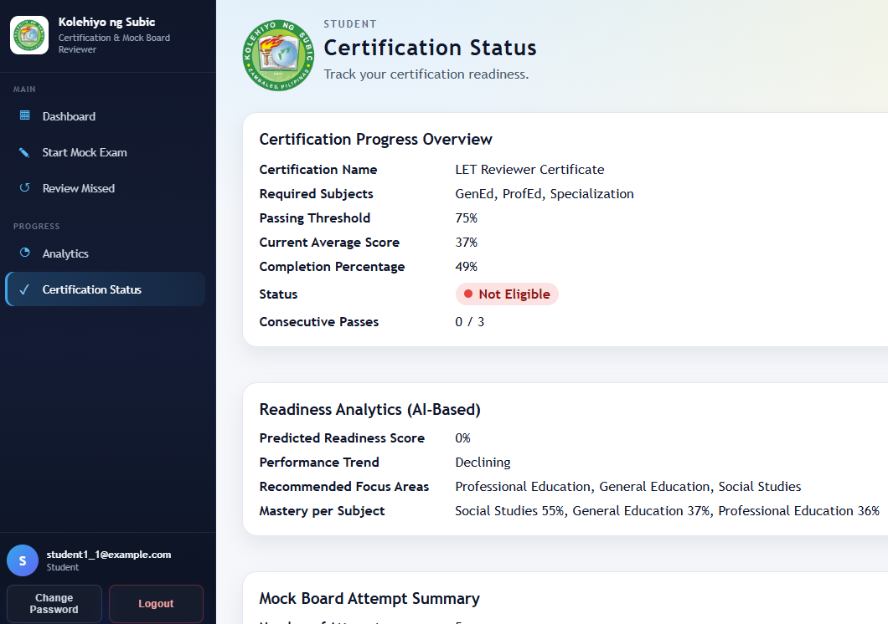

---

## 7. Instructor Guide

### 7.1 Instructor Dashboard
Shows classroom-wide summary cards:

- **Active Examinees**
- **Average Score**
- **Completion Rate**
- **Program** (your program/specialization)

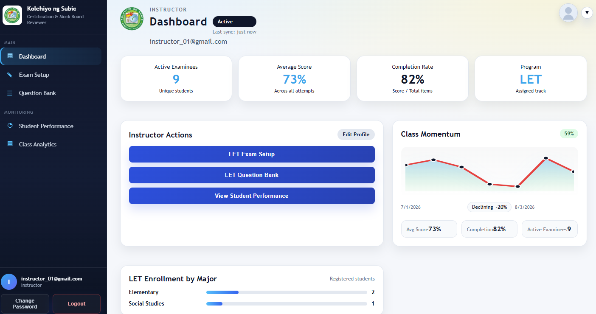

### 7.2 Exam Setup (Exam Configuration)
1. From the sidebar, click **Exam Setup**.
2. Configure the exam for your class/cohort:
   - Set **timer**, **item counts**, and other exam options.
   - Set or adjust the **passing threshold**.
3. Save your settings. These apply to the exams your students take.

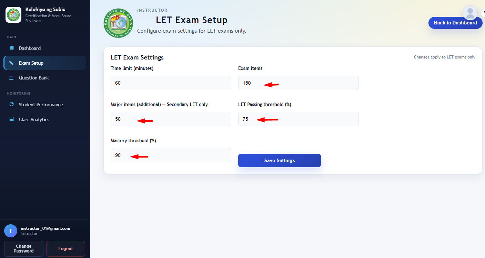

### 7.3 Question Bank
1. From the sidebar, click **Question Bank**.
2. You can **browse** the existing question library organized by subject.
3. Use the search or filters to find questions.

> Depending on your permissions, you may be able to add or edit questions. Contact your admin if you need question-writing access.

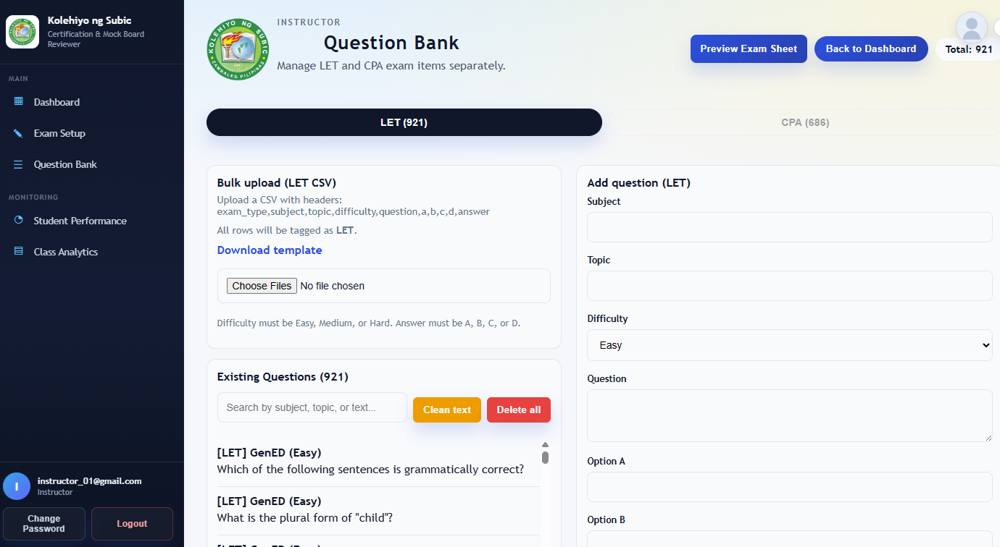

### 7.4 Student Performance
1. From the sidebar, click **Student Performance**.
2. See an **overview of each student** in your class:
   - Number of exams taken
   - Average scores
   - Pass/fail status
   - Progress over time
3. Click a student to view their **detailed performance**.

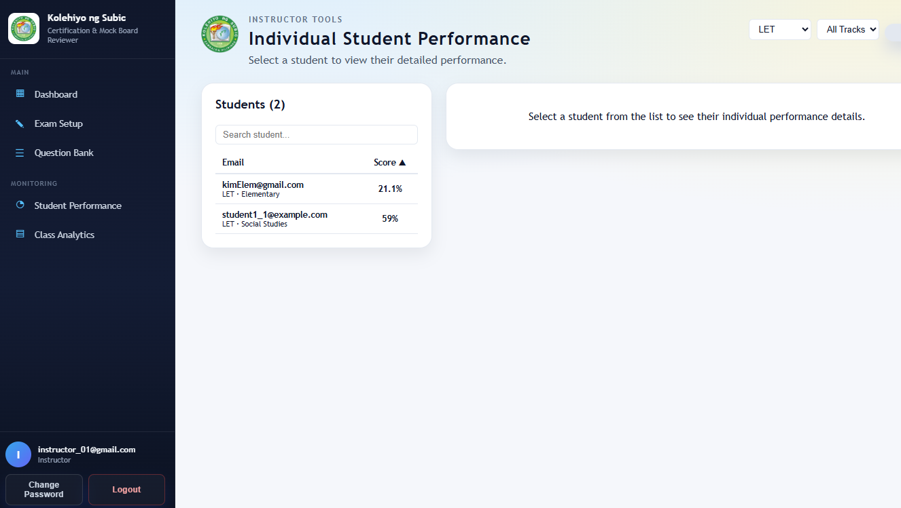

### 7.5 Class Analytics
1. From the sidebar, click **Class Analytics**.
2. View **class-wide statistics**, such as average scores, pass rates, and subject performance across all your students.
3. Use this to identify which topics the class struggles with and adjust your review sessions.

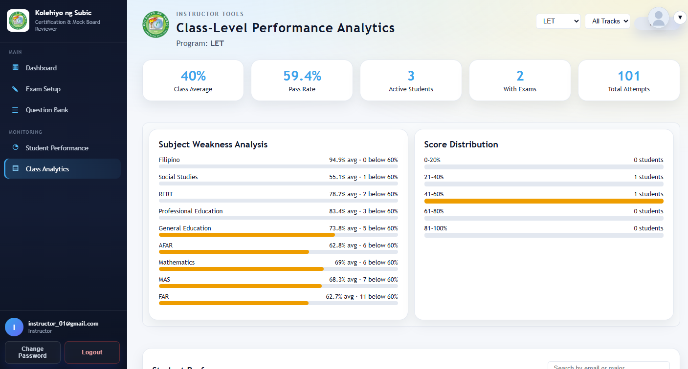

---

## 8. Administrator Guide

### 8.1 First-Time Setup: Creating the First Admin Account

On the very first use, someone must create the administrator account:

1. Open the **Admin Registration** page (the link is shown on the Login page).
2. Enter the **Admin Email**.
3. Enter a **Password**.
4. Enter the **Admin Key** — the secret key provided to you by the system implementer.
5. Click **Create Admin**.
6. A message confirms the account was created. Click **Back to login**.
7. Log in with the new admin credentials.

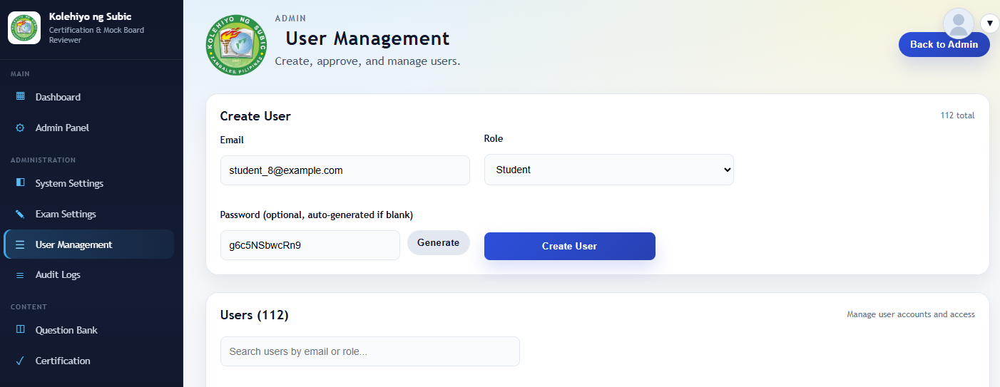

> There is only **one** self-registration in the whole system — this first admin account. All other users (including other admins) are managed from the Admin Panel.

### 8.2 Admin Panel (Hub)

After logging in as admin, click **Admin Panel** in the sidebar. This is the control center. It shows:

- **Summary cards:** Total Users, Exams Taken, Question Bank count, Pending Approvals
- A **Pending Access Requests** alert when there are requests waiting (click it to go straight to User Management)
- **Module cards** that jump to the pages below

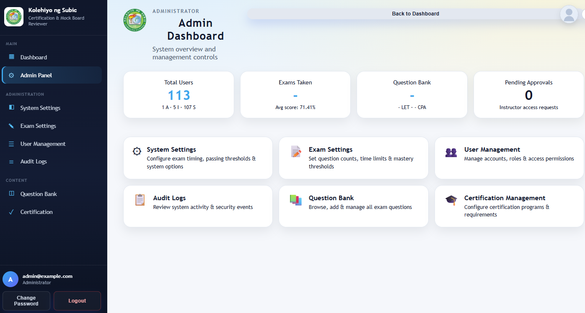

### 8.3 User Management (approve/deny access, manage users)

1. Open **User Management** from the Admin Panel (or the sidebar).
2. The user list shows all accounts. For each user you can see their role, status, and **access status**.
3. When a user has a pending request (e.g., a new student who just submitted their profile):
   - Click **Approve** to grant access — the user's Approval Pending screen will automatically refresh and they can start using the system.
   - Click **Deny** to reject the request.
4. Use the **Select All** checkbox in the header to select all students shown in the current filtered list at once.
5. You can also create accounts for new students/instructors or edit existing users here.

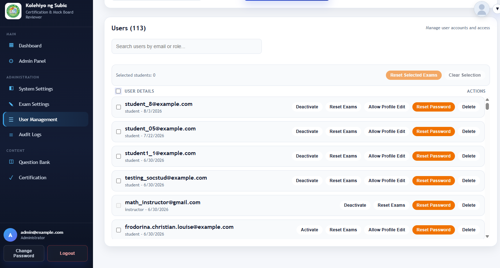

### 8.4 Exam Settings (global defaults)

1. Open **Exam Settings**.
2. Set the global defaults:
   - **Time limit (minutes)** — 10 to 240 (default 90)
   - **Exam items** — number of general questions (10 to 200, default 50)
   - **Major items (additional)** — 0 to 200 (default 50)
   - **Passing threshold default (%)** — 50 to 100 (default 75)
3. Manage **Target Licensure / Certification Categories** (e.g., LET, CPA, Internal Certification):
   - Click **Add Category** to add a new row.
   - Enter the **Category** name, **Subjects** (comma-separated), and **Passing Threshold (%)**.
   - Click **Remove** on a row to delete that category.
   - At least one valid category is required.
4. Click **Save Settings** when done.

> These categories are what students choose in their profile setup. Changing them changes the options available to new students.

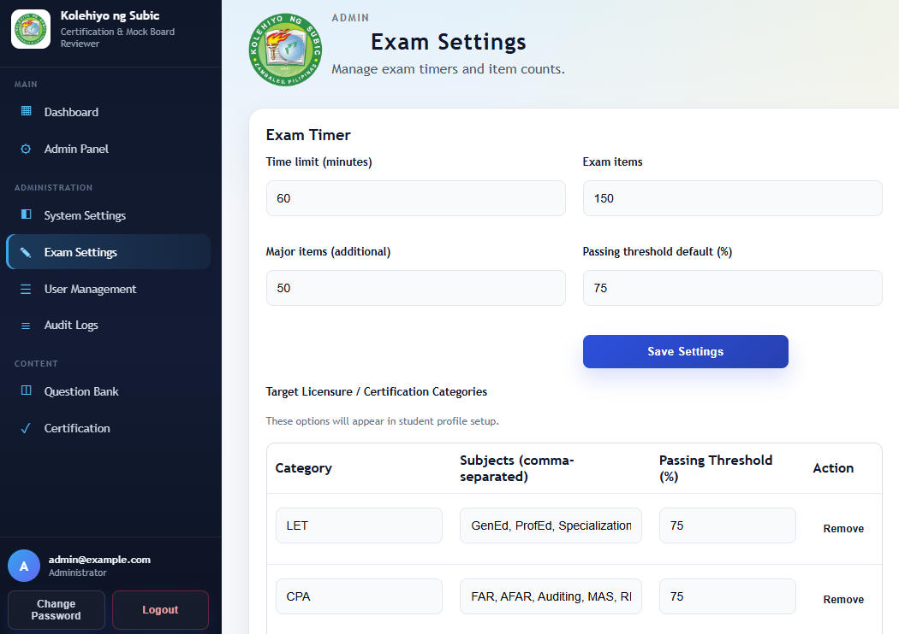

### 8.5 System Settings (branding & backup)

1. Open **System Settings**.

**Logo:**
- Click the file picker and select an **image file**.
- A preview appears. Click **Save Logo**.
- Click **Reset to Default** to go back to the default logo.
- Note: the logo is saved per **browser/device** (stored on that computer). Refresh other pages to see the change.

**School name:**
- Type the new name and click **Save School Name** (or **Reset School Name**).
- Note: like the logo, this is device/browser-specific.

**Database backup & restore:**
- **Download Database Backup** — downloads a `.zip` backup of the MongoDB database.
- **Restore database from backup (.zip)** — pick a backup file, then click **Restore Database** to restore it.

**Whole system backup & restore:**
- **Download System Backup** — downloads a `.zip` of the frontend + backend package.
- **Restore System** — restores the system from a `.zip` file. A message will note that the backend/frontend may need a restart to apply changes.

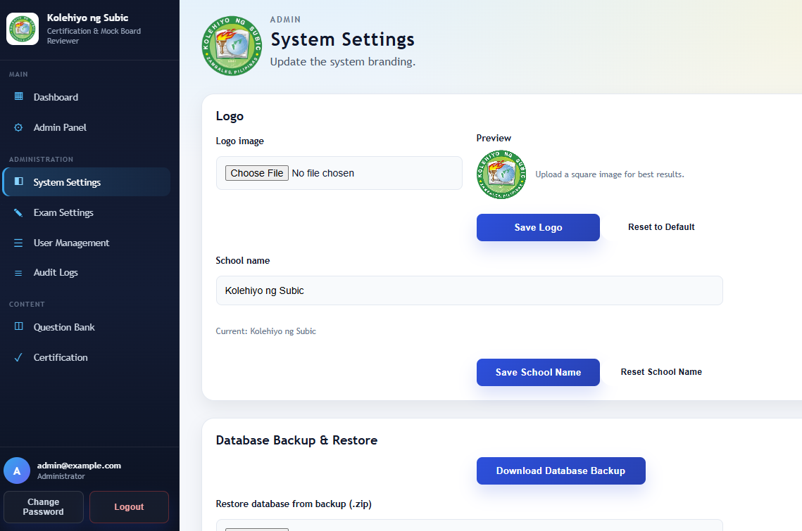

### 8.6 Audit Logs

1. Open **Audit Logs**.
2. Review **recent administrator activity** — each entry shows the action, details, and timestamp.
3. Use the **search box** to filter by action or detail text.
4. Use the **From** and **To** date pickers to filter by date range.

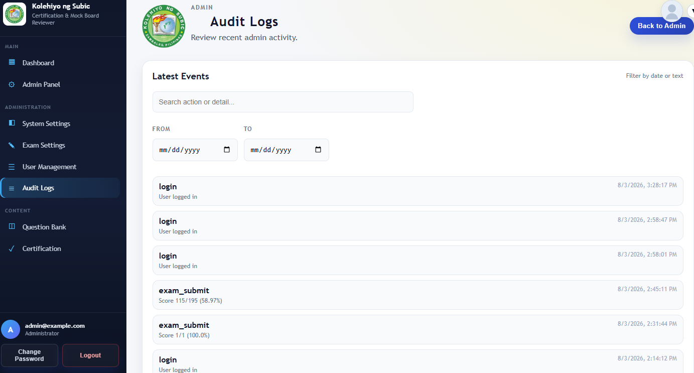

### 8.7 Certification Management

1. Open **Certification** (under Content in the sidebar).
2. Summary cards show **Issued Certificates**, **Pending Eligibility**, and **Revoked Certificates**.
3. **Pending Eligibility Approval:** when a learner reaches **3 consecutive passing mock board attempts**, they appear here. Click **Approve + Generate** to issue their certificate. A certificate ID and verification code are generated.
4. **Issued Certificates:** lists all certificates with ID, learner, category, issue date, and **verification code**. Click **Revoke** to revoke a certificate.
5. Give students their **verification code** so they can prove the certificate is authentic.

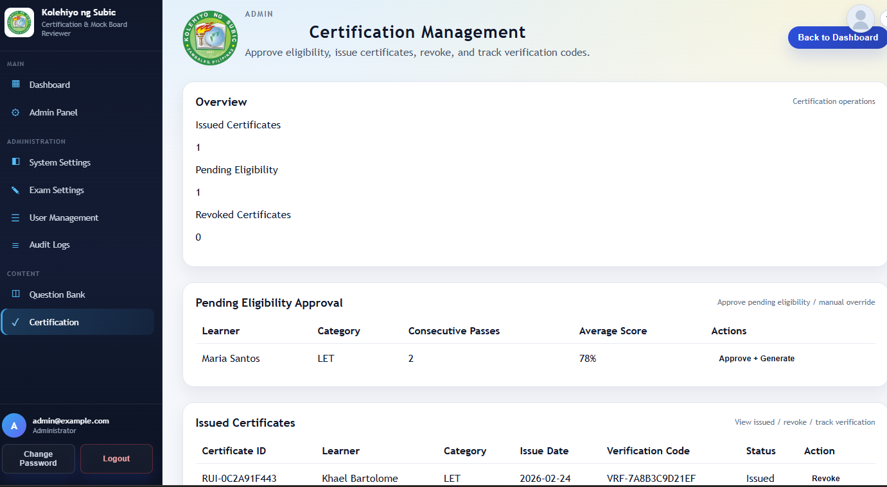

---

## 9. Sidebar & Common Actions

The **sidebar** appears on the left after you log in. It is different for each role.

- **Collapse/expand:** on small screens, use the **☰ (hamburger)** button at the top to open and close the sidebar.
- **Navigation:** click a link to open that page. The current page is highlighted.
- **Bottom of the sidebar:**
  - Your **email** and **role** are shown.
  - **Change Password** — opens the password change screen.
  - **Logout** — signs you out and returns you to the Login page.

> On mobile, tapping outside the sidebar closes it automatically.

---

## 10. Badges & Readiness Meaning

The system computes a **badge** from your latest exam percentage and groups it into a mastery band:

| Badge Color | Score | Band | Meaning |
|---|---|---|---|
| 🟢 Green | 90%+ | Mastery / Autonomous | Ready for certification / mock board pass |
| 🟡 Yellow | 75–89% | Developing | Needs targeted review |
| 🟠 Orange | 60–74% | Guided | Requires structured intervention |
| 🔵 Blue | 40–59% | Exploratory | Early-stage learning |
| 🔴 Red | below 40% | Struggling | Immediate remediation needed |

**Pass/fail:** a passing score is at or above the **Required Passing Threshold** for your target licensure (set by the admin, default 75%).

---

## 11. Troubleshooting

| Problem | Likely cause | Solution |
|---|---|---|
| Page won't load | No internet / server down | Check your connection, then contact your admin. |
| "Invalid email or password" on login | Wrong credentials | Double-check email and password; contact your admin if you forgot it. |
| Logged out suddenly | Session expired (2-hour timeout) | Log in again. |
| Stuck on "Approval Pending" | Admin has not reviewed yet | Wait — the page auto-refreshes every 10 seconds. If it has been more than 7 days, click **Resend approval request**. |
| "Access denied" | Request denied or account inactive | Contact your admin to reactivate your account. |
| Can't take an exam | Profile not set up / not approved | Complete the **Profile & Exam Setup** form and get approved. |
| Logo/school name didn't change | Branding is saved per browser/device | Open the same page in the same browser, or refresh other pages. |
| Restore didn't apply | Backend/frontend needs a restart | Restart the app as the on-screen message instructs. |
| Forgot password | — | Contact your administrator (there is no public reset). |

---

## 12. Frequently Asked Questions

**Q: How do I get an account?**
A: Contact your administrator. Students and instructors cannot register themselves; only admins create accounts (and the very first admin is created via the Admin Registration page).

**Q: How many passing attempts do I need for a certificate?**
A: You must reach **3 consecutive passing mock board attempts** based on your category's passing threshold. After that, the administrator approves your eligibility and issues the certificate.

**Q: What happens when the exam timer reaches zero?**
A: The exam is submitted automatically with the answers you have provided so far.

**Q: Are my review materials personalized?**
A: Yes. Based on your exam results and weak subjects, the system recommends a difficulty level, review materials per subject, and a weekly schedule on your Dashboard.

**Q: Why does my recommendation say "Foundational" or "Guided"?**
A: Those are difficulty bands computed from your score. As your scores improve, the recommended difficulty increases (see [Section 10](#10-badges--readiness-meaning)).

**Q: Can I change my profile after approval?**
A: Yes. Edit it from the Dashboard. Saving changes submits a new request that the admin must approve.

---

*End of manual. For support, contact your instructor or administrator.*

---

## Appendix A: Screenshot Checklist

To add the images, capture a screenshot of each page below and save it in the **`docs/images/user-manual/`** folder using the exact filename listed. Then commit and push. Each screenshot appears automatically in the matching section of this manual.

> When taking the screenshots, note which role the page belongs to (you must be logged in as that role) and that the logo/school name shown is saved per browser/device.

| # | Filename | Page (role) | What to capture |
|---|---|---|---|
| 01 | `01-login.png` | Login page (all) | Login form with logo and school name |
| 02 | `02-admin-register.png` | Admin Registration (public) | Email, password, admin key form |
| 03 | `03-student-profile-setup.png` | Student Profile & Exam Setup (student) | Full form incl. subject chips |
| 04 | `04-approval-pending.png` | Approval Pending (student) | Pending status and message |
| 05 | `05-student-dashboard.png` | Student Dashboard | Summary cards + recommendations |
| 06 | `06-exam-preview.png` | Exam Preview (student) | Exam rules: timer, items, threshold |
| 07 | `07-exam.png` | Exam screen (student) | A question with the timer running |
| 08 | `08-review-missed.png` | Review Missed (student) | List of incorrectly answered items |
| 09 | `09-analytics.png` | Analytics (student) | Score history / charts |
| 10 | `10-certification-status.png` | Certification Status (student) | Eligibility and verification code |
| 11 | `11-instructor-dashboard.png` | Instructor Dashboard (instructor) | Class-wide summary cards |
| 12 | `12-exam-setup.png` | Instructor Exam Setup (instructor) | Exam configuration form |
| 13 | `13-question-bank.png` | Question Bank (instructor/admin) | Question library |
| 14 | `14-student-performance.png` | Student Performance (instructor) | Table of students |
| 15 | `15-class-analytics.png` | Class Analytics (instructor) | Class-wide statistics |
| 16 | `16-admin-panel.png` | Admin Panel (admin) | Stat cards and module cards |
| 17 | `17-user-management.png` | User Management (admin) | User list + approve/deny |
| 18 | `18-exam-settings.png` | Admin Exam Settings (admin) | Timers and licensure categories |
| 19 | `19-system-settings.png` | Admin System Settings (admin) | Logo, school name, backup |
| 20 | `20-audit-logs.png` | Audit Logs (admin) | Activity log feed |
| 21 | `21-certification-management.png` | Certification Management (admin) | Pending eligibility and issued certs |

```text
docs/images/user-manual/
├── README.md          <- guide on how to take/name the screenshots
├── 01-login.png       <- your screenshots go here (drop them in)
├── 02-admin-register.png
├── ... (21 files total)
```

After adding the images, the `USER_MANUAL.md` will display them inline. Until a filename exists, the manual shows a broken image icon for that entry.
